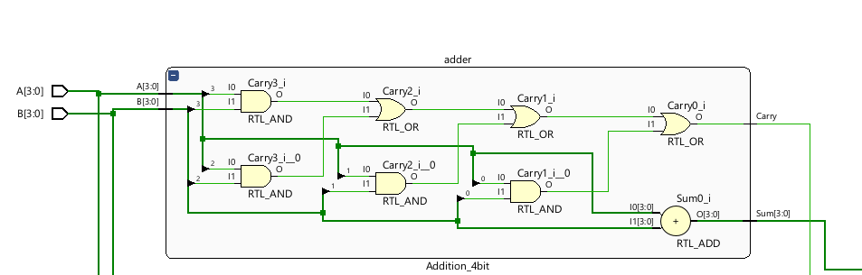
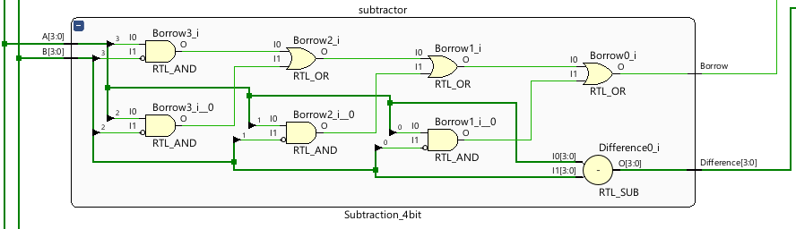
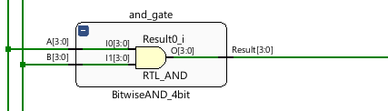
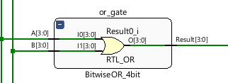
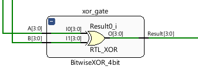
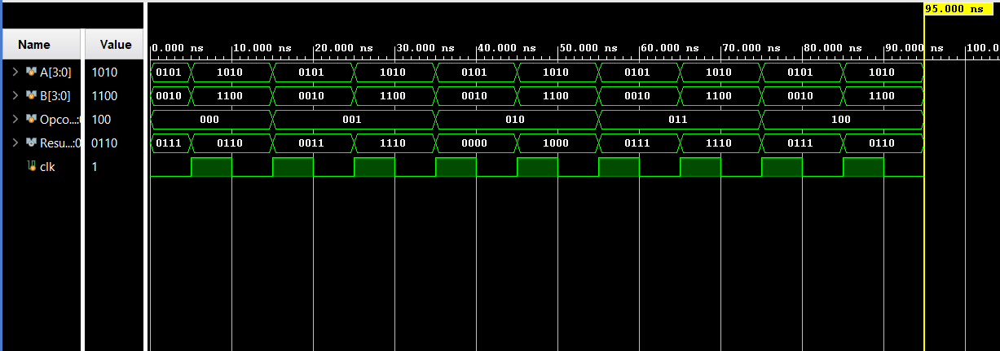

# Design of a 4-bit Arithmetic Logic Unit (ALU)

Digital Logic Design Project Source Codes

## Table of Contents

1. [Introduction](#1-introduction)
2. [Requirements](#2-requirements)
3. [Usage](#3-usage)
4. [Design](#4-design)
   1. [Adder](#41-addition)
   2. [Substraction](#42-substraction)
   3. [Bitwise AND](#43-bitwise-and)
   4. [Bitwise OR](#44-bitwise-or)
   5. [Bitwise XOR](#45-bitwise-xor)
5. [Simulation Results](#5-simulation-results)
6. [License](#6-license)
7. [Authors](#7-authors)

## 1. Introduction

In this project, we design and implement a 4-bit ALU using combinational logic circuits, including AND, OR, NOT, XOR, and MUX gates. The ALU should be able to perform the following operations on two 4-bit binary numbers, A and B:

· Addition (A + B)

· Subtraction (A - B)

· Bitwise AND (A & B)

· Bitwise OR (A | B)

· Bitwise XOR (A ^ B)

## 2. Requirements

- [XilinxVivado](https://www.xilinx.com/support/download.html)

## 3. Usage

There are seven type of file in the project. You can go any file you want and run exe files. To run main exe file ALU4BIT_Project.xpr click this file double. It will automatically open if you have installed the Xilinx Vivado.

 </img>

## 4. Design

The 4-bit Arithmetic Logic Unit (ALU) circuit will be meticulously designed using combinational logic circuits. It will encompass a variety of logical gates, including AND, OR, NOT, and XOR, which are fundamental components for performing arithmetic and logical operations. In addition, the ALU will incorporate multiplexers (MUXes) to facilitate the selection of appropriate inputs based on the desired operation.
The 4-bit Arithmetic Logic Unit (ALU) circuit will be designed using combinational logic circuits, including AND, OR, NOT, and XOR gates. Multiplexers (MUXes) will be incorporated to select inputs based on the desired operation.
The ALU operates on two 4-bit inputs, A and B, and produces a 4-bit output, Result. Control signals determine the operation performed. Logical gates and multiplexers process the inputs to generate the output.
The AND gate performs bitwise AND operations on corresponding bits of A and B. The OR gate computes bitwise OR operations, and the XOR gate calculates bitwise exclusive OR operations. The NOT gate enables subtraction using two's complement representation.
Multiplexers allow input selection based on control signals. This enables the ALU to perform addition, subtraction, bitwise AND, OR, and XOR operations on the 4-bit inputs.
Overall, the 4-bit ALU design incorporates necessary logical gates and multiplexers to support desired arithmetic and logical operations. It considers binary representation of inputs to generate the 4-bit output, Result.

### 4.1. Addition

- The Arithmetic Logic Unit (ALU) utilizes a combination of XOR and AND gates to perform addition. The output bits, referred to as "Result," are obtained by performing an XOR operation between the corresponding bits of A and B. Simultaneously, the carry bit is calculated using an AND gate. This process ensures the accuracy of the addition operation by correctly determining the sum of each bit while considering any carry-over.
  To elaborate further, during the addition process, the XOR operation calculates the difference between the corresponding bits of A and B. This difference is obtained by XORing each bit pair. Additionally, the carry bit is generated by applying the AND operation to the
  corresponding bits of A and B. The AND gate produces the carry bit based on whether both input bits are set to 1.
  By combining these operations, the ALU ensures that each bit is accurately added, and any carry-over is properly accounted for. The XOR operation handles the bit-level differences, while the AND operation determines the carry bit. The resulting sum of each bit and the carry bit are represented in the output of the ALU as the "Result" bits.
  This design guarantees the integrity of the addition operation by accurately summing the corresponding bits of A and B and considering the carry bit. It ensures consistent and reliable results, making it suitable for use in various computational tasks.
  
  

    </img>
  

### 4.2. Subtraction

- In the Arithmetic Logic Unit (ALU), subtraction is achieved by utilizing a method known as two's complement representation. This process involves converting the second operand, B, into its two's complement form and then performing addition.
  To obtain the two's complement representation of B, all bits of B are inverted (flipped) to their opposite values, and 1 is added to the result. This transformation effectively creates the negation of B. The resulting value represents the two's complement representation of B.
  Once the two's complement representation of B is obtained, it is added to the first operand, A, using the same addition circuitry employed in the ALU for addition operations. The addition circuit is capable of performing both regular addition and addition with the two's complement representation.
  By using the two's complement representation and the existing addition circuit, the ALU is able to perform subtraction effectively. The addition of the two's complement value of B to A produces the correct subtraction result, taking into account the negation of B.
  This approach allows the ALU to handle subtraction operations within its computational capabilities, providing accurate and reliable results. By employing the concept of two's complement representation and utilizing the addition circuit, the ALU enhances its functionality and versatility in performing both addition and subtraction operations.
  
  

    </img>
  

### 4.3. Bitwise AND

- The bitwise AND operation involves using the AND gate to compare each corresponding pair of bits from the inputs A and B. The output bits of the Result will reflect the logical AND of the corresponding input bits. In other words, for each position, if both input bits are 1, the corresponding output bit will be set to 1. Otherwise, if any of the input bits at that position is 0, the output bit will be 0. The bitwise AND operation is commonly used for masking or extracting specific bits from binary values, as well as for performing logical tests and setting conditions based on the individual bits of the inputs
  
  

    </img>
  

### 4.4. Bitwise OR

- The bitwise OR operation involves using the OR gate to compare each corresponding pair of bits from the inputs A and B. The output bits of the Result will reflect the logical OR of the corresponding input bits. In other words, if either of the input bits at a specific position is 1, the corresponding output bit will be set to 1. Only when both input bits are 0 will the output bit be 0. The bitwise OR operation is commonly used to combine or merge binary values, allowing for the extraction of specific bits or the creation of logical conditions based on the individual bits of the inputs.
  
  

### 4.5. Bitwise XOR

- The bitwise XOR operation will be performed by utilizing the XOR gate to evaluate each corresponding pair of bits from A and B. This operation yields the logical XOR of the corresponding input bits, resulting in the output bits of the Result. In other words, for each position of the binary numbers A and B, if the bits are different, the corresponding output bit will be set to 1; otherwise, it will be set to 0. The bitwise XOR operation provides a way to determine the differing bits between two binary numbers and is commonly used in various arithmetic and logical operations.
  
  

## 5. Simulation Results

- Functional simıulation of the 4-bit ALU circuit was done using Vivado esign Suite. We aimed to verify the accuracy and functionality of thr ALU in performing various arithmetic and logical operations on simulation,4-bit binary numbers.
  ● Test Case 1 - Addition: A= 0101, B= 0010
  Expected Result: 0111
  Observed Result: 0111 (Passed)

  ● Test Case 2 - Addition: A= 1010, B= 1100
  Expected Result: 0110
  Observed Result: 0110 (Passed)

  ● Test Case 3 – Subtraction : A= 0101, B= 0010
  Expected Result: 0011
  Observed Result: 0011 (Passed)

  ● Test Case 4 – Subtraction : A= 1010, B= 1100
  Expected Result: 1110
  Observed Result: 1110 (Passed)

  ● Test Case 5 - And : A= 0101, B= 0010
  Expected Result: 0000
  Observed Result: 0000 (Passed)

  ● Test Case 6 – And : A= 1010, B= 1100
  Expected Result: 1000
  Observed Result: 1000 (Passed)

  ● Test Case 7 – OR : A= 0101, B= 0010
  Expected Result: 0111
  Observed Result: 0111 (Passed)

  ● Test Case 8 – OR : A= 1010, B= 1100
  Expected Result: 1110
  Observed Result: 1110 (Passed)

  ● Test Case 9 – XOR : A= 0101, B= 0010
  Expected Result: 0111
  Observed Result: 0111 (Passed)

  ● Test Case 10 – XOR : A= 1010, B= 1100
  Expected Result: 0110
  Observed Result: 0110 (Passed)
  
  

## 6. License

[Apache License 2.0 | Choose a License](https://choosealicense.com/licenses/apache-2.0/)

## 7. Authors

- [Samet Karaş - GitHub](https://github.com/SametKaras)
- [Eray Burak Çakır - GitHub](https://github.com/cakirerayburak)
- [Süleyman Mert Almalı - GitHub](https://github.com/Mertalmali4)
